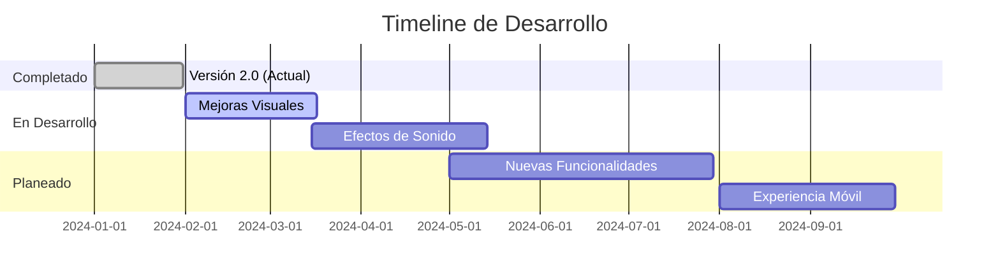

Tienes razón, los enlaces del índice no funcionan porque los anchors tienen espacios y caracteres especiales. Aquí tienes el README con los enlaces del índice **corregidos**:

## 📄 **README.md (ENLACES CORREGIDOS)**

# ⚔️ SURVIVORS - Batalla Épica

Juego de simulación donde personajes Buenos (B) y Malos (M) luchan en un tablero con obstáculos (#). Los personajes se mueven, persiguen a sus enemigos y combaten hasta que solo queda un bando.


---

## 📑 ÍNDICE

- [🎮 DESCRIPCIÓN DEL JUEGO](#-descripción-del-juego)
- [✨ NOVEDADES EN VERSIÓN 2.0](#-novedades-en-versión-20)
- [📁 ESTRUCTURA DE ARCHIVOS](#-estructura-de-archivos)
- [🚀 CÓMO EJECUTAR](#-cómo-ejecutar)
- [🎯 CARACTERÍSTICAS PRINCIPALES](#-características-principales)
- [🎮 CONTROLES DEL JUEGO](#-controles-del-juego)
- [📚 EXPLICACIÓN DEL CÓDIGO](#-explicación-del-código)
  - [1. HTML (index.html)](#1-html-indexhtml)
  - [2. CSS (style.css)](#2-css-stylecss)
  - [3. Clases JavaScript](#3-clases-javascript)
  - [4. Funciones Utilitarias (Funciones.js)](#4-funciones-utilitarias-funcionesjs)
  - [5. Control Principal (survivors.js)](#5-control-principal-survivorsjs)
- [🔄 FLUJO DEL JUEGO](#-flujo-del-juego)
- [⚙️ OPCIONES DE CONFIGURACIÓN](#-opciones-de-configuración)
- [🏆 SISTEMA DE VICTORIAS](#-sistema-de-victorias)
- [🚀 HOJA DE RUTA - FUTURAS EXPANSIONES](#-hoja-de-ruta---futuras-expansiones)
  - [📁 CARPETA ASSETS](#-carpeta-assets)
  - [🎯 PRÓXIMAS MEJORAS PLANEADAS](#-próximas-mejoras-planeadas)
  - [💡 IDEAS ADICIONALES](#-ideas-adicionales)
  - [🛠️ CÓMO CONTRIBUIR](#-cómo-contribuir)
  - [📊 ESTADO DEL PROYECTO](#-estado-del-proyecto)
- [🎨 PERSONALIZACIÓN](#-personalización)
- [🐛 SOLUCIÓN DE PROBLEMAS COMUNES](#-solución-de-problemas-comunes)
- [📝 NOTAS PARA DESARROLLADORES](#-notas-para-desarrolladores)
- [📄 LICENCIA](#-licencia)

---

## 🎮 DESCRIPCIÓN DEL JUEGO

**Survivors** es una simulación de batalla entre dos bandos:
- **Buenos (B)** - Representados en color verde 🟢
- **Malos (M)** - Representados en color rojo 🔴
- **Obstáculos (#)** - Elementos estáticos que bloquean el paso

Los personajes se mueven aleatoriamente por el tablero, pero cuando detectan un enemigo cercano, se mueven hacia él para combatir. El combate se resuelve mediante un sistema de probabilidad basado en la vida de cada personaje.

---

## ✨ NOVEDADES EN VERSIÓN 2.0

- ✅ **Sistema de Pausa/Continuar** - Detén y reanuda la batalla cuando quieras
- ✅ **Contador de Victorias Global** - Estadísticas persistentes entre partidas
- ✅ **Almacenamiento Local** - Las victorias se guardan aunque cierres el navegador
- ✅ **Animaciones de Victoria** - Efectos visuales al ganar una batalla
- ✅ **Consola Limpia** - Mensajes organizados con colores y formato
- ✅ **Botón de Reinicio de Victorias** - Resetea los contadores cuando quieras
- ✅ **Favicon personalizado** - Icono en la pestaña del navegador
- ✅ **Carpeta Assets** - Estructura preparada para futuras expansiones

---

## 📁 ESTRUCTURA DE ARCHIVOS

```
survivors-js/
│   
├── 📄 index.html                          # Interfaz de usuario
├── 📁 css/
│   └── 📄 style.css                        # Estilos visuales
├── 📁 assets/                              # Recursos adicionales
│   ├── 📁 images/                           # Imágenes y favicons
│   │   └── 🖼️ favicon.svg                     # Icono de la pestaña
│   ├── 📁 icons/                            # Iconos SVG (próximamente)
│   ├── 📁 sounds/                           # Efectos de sonido (próximamente)
│   └── 📁 fonts/                            # Fuentes personalizadas (próximamente)
├── 📁 Entidades/                            # Clases del juego
│   ├── 📄 Entidad.js                          # Clase base
│   ├── 📄 Personajes.js                       # Clase para personajes
│   ├── 📄 Buenos.js                           # Buenos (hereda de Personajes)
│   ├── 📄 Malos.js                            # Malos (hereda de Personajes)
│   ├── 📄 Obstaculos.js                       # Obstáculos (hereda de Entidad)
│   └── 📁 ListFunciones/
│       └── 📄 Funciones.js                    # Utilidades del juego
└── 📄 survivors.js                          # Control principal
```

---

## 🚀 CÓMO EJECUTAR

1. **Descarga todos los archivos** manteniendo la estructura de carpetas
2. **Abre el archivo `index.html`** en cualquier navegador moderno
3. **Configura el juego**:
   - Ajusta las dimensiones del tablero (pares, mínimo 10)
   - Selecciona el modo de generación de personajes
   - Si eliges la opción 1, introduce el número de personajes
4. **Haz clic en "COMENZAR BATALLA"**
5. **Observa la batalla** en tiempo real
6. **Usa los controles** para pausar, continuar o reiniciar

---

## 🎯 CARACTERÍSTICAS PRINCIPALES

- ✅ **Interfaz responsive** - Se adapta a móviles, tablets y desktop
- ✅ **Cálculo automático** de dimensiones óptimas según tu pantalla
- ✅ **Tres modos de generación** de personajes
- ✅ **Sistema de combate** basado en probabilidad
- ✅ **Persecución inteligente** - Los personajes persiguen a sus enemigos
- ✅ **Estadísticas en tiempo real** - Total, Buenos y Malos
- ✅ **Control de velocidad** - Ajusta la velocidad de la simulación
- ✅ **Diseño cyberpunk** con efectos neón y animaciones
- ✅ **Sistema de pausa/continuar** - Control total de la simulación
- ✅ **Contador de victorias global** - Estadísticas persistentes

---

## 🎮 CONTROLES DEL JUEGO

| Botón | Función | Descripción |
|-------|---------|-------------|
| **▶ COMENZAR** | `iniciarSimulacion()` | Inicia una nueva batalla |
| **⏹ PAUSAR** | `detenerSimulacion()` | Pausa la simulación actual |
| **▶ CONTINUAR** | `continuarSimulacion()` | Reanuda la simulación pausada |
| **↺ REINICIAR** | `volverAlMenu()` | Vuelve al menú principal |
| **⚡ - / ⚡ +** | `ajustarVelocidad()` | Cambia la velocidad de la simulación |
| **↺ (en victorias)** | `reiniciarVictorias()` | Resetea los contadores de victorias |

---

## 📚 EXPLICACIÓN DEL CÓDIGO

### [1. HTML (index.html)](index.html)

El HTML define la estructura visual del juego con **IDs específicos** que JavaScript utiliza para interactuar:

| ID | Propósito |
|----|-----------|
| `totalStats`, `buenosStats`, `malosStats` | Contadores que se actualizan |
| `victoriasBuenos`, `victoriasMalos` | Contadores de victorias globales |
| `menuPanel` | Panel de configuración (se oculta/muestra) |
| `tablero` | Contenedor del tablero (se oculta/muestra) |
| `tableroContainer` | Donde se pinta el tablero |
| `resultadoPanel` | Panel de resultados |
| `startBtn` | Botón de inicio |
| `alturaInput`, `anchuraInput` | Inputs de dimensiones |
| `btnPausa`, `btnContinuar` | Botones de control de simulación |

**Conceptos clave:**
- `class="hidden"` - Clase utility para ocultar elementos
- `id=""` - Identificador único para JavaScript
- `onclick=""` - Evento que llama a funciones JavaScript

### [2. CSS (style.css)](css/style.css)

El CSS utiliza **variables** y **media queries** para adaptarse a diferentes pantallas:

```css
/* Variables CSS para facilitar cambios */
:root {
    --color-neon-blue: #00ffff;
    --color-neon-green: #00ff00;
    --color-neon-red: #ff0000;
    --color-gold: #ffd700;
    --spacing-md: clamp(15px, 3vw, 25px);
}

/* Panel de victorias */
.victorias-panel {
    background: rgba(10, 10, 20, 0.8);
    border: 2px solid gold;
    box-shadow: 0 0 20px gold;
}

/* Animación de victoria */
@keyframes victoriaPulse {
    0%, 100% { transform: scale(1); }
    50% { transform: scale(1.2); }
}

/* Media queries para responsive */
@media (max-width: 768px) {
    .options-grid {
        grid-template-columns: 1fr;
    }
}
```

### 3. Clases JavaScript

#### [Entidad.js - Clase Base](Entidades/Entidad.js)
```javascript
class Entidad {
    constructor(y, x, vx, vy) {
        this.y = y;  // Posición Y
        this.x = x;  // Posición X
        this.vy = vy; // Velocidad Y
        this.vx = vx; // Velocidad X
    }
    
    distanciaCon(ent) {
        return Math.sqrt(Math.pow(this.x - ent.x, 2) + Math.pow(this.y - ent.y, 2));
    }
    
    mover(ancho, alto, arrayEntidades) {
        // Movimiento aleatorio en 8 direcciones
        const direcciones = [[-1,-1], [-1,0], [-1,1], [0,-1], [0,1], [1,-1], [1,0], [1,1]];
        // Lógica de movimiento...
    }
}
```

#### [Personajes.js](Entidades/Personajes.js)
```javascript
class Personajes extends Entidad {
    static nPersonajes = 0; // Variable estática
    
    constructor(y, x, vx, vy) {
        super(y, x, vx, vy);
        this.vida = Math.floor(Math.random() * 91) + 10; // Vida entre 10-100
        Personajes.nPersonajes++;
    }
}
```

#### [Buenos.js](Entidades/Buenos.js)
```javascript
class Buenos extends Personajes {
    static nBuenos = 0;
    
    constructor(y, x) {
        super(y, x, 1, 1);
        this.malos = null; // Referencia al malo más cercano
        Buenos.nBuenos++;
    }
    
    mover(ancho, alto, arrayEntidades) {
        if (this.malos && this.estaCercaDe(this.malos, 10)) {
            // Persigue al malo (lógica de persecución)
            if (this.x < this.malos.x) this.setVx(-1);
            // ...
        } else {
            super.mover(ancho, alto, arrayEntidades);
        }
    }
    
    toString() { return 'B'; }
}
```

#### [Malos.js](Entidades/Malos.js)
```javascript
class Malos extends Personajes {
    static nMalos = 0;
    
    constructor(y, x) {
        super(y, x, 1, 1);
        this.bueno = null; // Referencia al bueno más cercano
        Malos.nMalos++;
    }
    
    mover(ancho, alto, arrayEntidades) {
        // Lógica similar a Buenos pero con direcciones invertidas
        if (this.bueno && this.estaCercaDe(this.bueno, 10)) {
            if (this.x < this.bueno.x) this.setVx(1); // Hacia la derecha
            // ...
        }
    }
    
    toString() { return 'M'; }
}
```

#### [Obstaculos.js](Entidades/Obstaculos.js)
```javascript
class Obstaculos extends Entidad {
    constructor(y, x) {
        super(y, x, 0, 0); // No se mueve
    }
    
    toString() { return '#'; }
}
```

### [4. Funciones Utilitarias (Funciones.js)](Entidades/ListFunciones/Funciones.js)

```javascript
const Funciones = {
    numPorcent(altura, anchura) {
        return Math.floor(Math.random() * (altura * anchura * 0.005)) + 1;
    },
    
    generador(altura, anchura, arrayEntidades, arrayPersonajes, nPersonajes, porBuenos, opcion) {
        this.generadorEntidades(altura, anchura, arrayEntidades, 0.01);
        // Genera personajes según opción...
    },
    
    pintarTablero(altura, anchura, arrayEntidades) {
        let sb = '╔' + '═'.repeat(anchura) + '╗\n';
        for (let i = 0; i < altura; i++) {
            sb += '║';
            for (let j = 0; j < anchura; j++) {
                const celda = arrayEntidades[i][j];
                if (celda === null) sb += ' ';
                else if (celda instanceof Buenos) sb += `<span style="color: #00ff00">${celda}</span>`;
                else if (celda instanceof Malos) sb += `<span style="color: #ff0000">${celda}</span>`;
                else if (celda instanceof Obstaculos) sb += celda;
            }
            sb += '║\n';
        }
        sb += '╚' + '═'.repeat(anchura) + '╝';
        return '<div class="board-content">' + sb + '</div>';
    },
    
    eliminarPersonaje(nPersonajes, arrayPersonajes, arrayEntidades, entidad, x, y) {
        for (let i = 0; i < nPersonajes; i++) {
            if (arrayPersonajes[i] === entidad) {
                arrayPersonajes[i] = null;
                arrayEntidades[y][x] = null;
                Personajes.setnPersonajes(Personajes.getnPersonajes() - 1);
                if (entidad instanceof Buenos) Buenos.setnBuenos(Buenos.getnBuenos() - 1);
                else if (entidad instanceof Malos) Malos.setnMalos(Malos.getnMalos() - 1);
                break;
            }
        }
    }
};
```

### [5. Control Principal (survivors.js)](survivors.js)

```javascript
// Variables globales
let intervaloSimulacion = null;
let opcionSeleccionada = null;
let simulacionPausada = false;
let victoriasBuenos = 0;
let victoriasMalos = 0;

// Inicialización
document.addEventListener('DOMContentLoaded', () => {
    calcularDimensionesRecomendadas();
    cargarVictorias(); // Carga victorias guardadas
    // Configurar event listeners...
});

// Funciones de control
function detenerSimulacion() {
    if (intervaloSimulacion) {
        clearInterval(intervaloSimulacion);
        intervaloSimulacion = null;
        simulacionPausada = true;
        console.log('⏸️ Simulación pausada');
    }
}

function continuarSimulacion() {
    if (simulacionPausada && arrayEntidades && arrayPersonajes) {
        intervaloSimulacion = setInterval(
            () => actualizarJuego(alturaActual, anchuraActual, nPersonajesActual), 
            velocidadActual
        );
        simulacionPausada = false;
        console.log('▶️ Simulación reanudada');
    }
}

function limpiarConsola(titulo = null) {
    console.clear();
    console.log('%c' + '═'.repeat(50), 'color: #00ffff');
    if (titulo) {
        console.log(`%c${titulo}`, 'color: #00ffff; font-size: 14px; font-weight: bold');
        console.log('%c' + '═'.repeat(50), 'color: #00ffff');
    }
    console.log('');
}
```

---

## 🔄 FLUJO DEL JUEGO

```
1. INICIO
   ↓
2. CONFIGURACIÓN (usuario elige opciones)
   ↓
3. GENERACIÓN DEL MUNDO
   ├── Obstáculos aleatorios
   └── Personajes según opción
   ↓
4. BUCLE PRINCIPAL (cada X ms)
   ├── Asignar enemigos cercanos
   ├── Mover personajes
   ├── Detectar colisiones
   ├── Resolver combates
   └── Actualizar pantalla
   ↓
5. ¿PAUSA? → Estado PAUSADO → CONTINUAR → Vuelve al bucle
   ↓
6. FIN DEL JUEGO
   ├── Victoria de Buenos → +1 victoria Buenos
   └── Victoria de Malos → +1 victoria Malos
   ↓
7. GUARDAR VICTORIAS en localStorage
   ↓
8. MOSTRAR RESULTADO
   ↓
9. VOLVER AL MENÚ
```

---

## ⚙️ OPCIONES DE CONFIGURACIÓN

| Opción | Descripción | Cuándo usarla |
|--------|-------------|---------------|
| **1. Mitad Buenos y Malos** | Tú eliges el número total (debe ser par) | Para controlar exactamente cuántos personajes quieres |
| **2. Totalmente Aleatorio** | Número y distribución aleatorios | Para partidas rápidas e impredecibles |
| **3. Mitad Aleatoria** | Número aleatorio pero par | Para sorpresa pero con equilibrio |

---

## 🏆 SISTEMA DE VICTORIAS

El juego incluye un sistema de estadísticas globales:

### Características:
- **Persistencia**: Las victorias se guardan en `localStorage`
- **Visualización**: Panel con contadores en tiempo real
- **Animaciones**: El contador parpadea cuando un bando gana
- **Reinicio**: Botón para resetear los contadores

### Código relevante:
```javascript
// Guardar victorias
function guardarVictorias() {
    localStorage.setItem('victoriasBuenos', victoriasBuenos);
    localStorage.setItem('victoriasMalos', victoriasMalos);
}

// Cargar victorias
function cargarVictorias() {
    const guardadasBuenos = localStorage.getItem('victoriasBuenos');
    const guardadasMalos = localStorage.getItem('victoriasMalos');
    if (guardadasBuenos !== null) victoriasBuenos = parseInt(guardadasBuenos);
    if (guardadasMalos !== null) victoriasMalos = parseInt(guardadasMalos);
    actualizarVictoriasVisuales();
}
```

---

## 🚀 HOJA DE RUTA - FUTURAS EXPANSIONES

### 📁 CARPETA ASSETS

La carpeta `assets/` está estructurada para facilitar futuras mejoras:

```
📁 assets/
├── 📁 images/     # Imágenes, logos y favicons
│   └── 🖼️ favicon.svg (actual)
├── 📁 icons/      # Iconos SVG para la interfaz (próximamente)
├── 📁 sounds/     # Efectos de sonido (próximamente)
└── 📁 fonts/      # Fuentes personalizadas (próximamente)
```

### 🎯 PRÓXIMAS MEJORAS PLANEADAS

#### Fase 1 - Mejoras Visuales (Corto plazo)
- [ ] **Logo del juego** - `assets/images/logo.png`
- [ ] **Iconos temáticos** - `assets/icons/bueno.svg`, `assets/icons/malo.svg`
- [ ] **Fondos dinámicos** - `assets/images/backgrounds/`
- [ ] **Efectos de partículas** para combates

#### Fase 2 - Efectos de Sonido (Medio plazo)
- [ ] `battle-start.mp3` - Sonido al comenzar la batalla
- [ ] `victory.mp3` - Fanfarria de victoria
- [ ] `combat.mp3` - Efecto en cada combate
- [ ] `move.mp3` - Sonido de movimiento
- [ ] `death.mp3` - Sonido al morir un personaje

```javascript
// Ejemplo de implementación de sonidos
function playSound(soundName) {
    const audio = new Audio(`assets/sounds/${soundName}.mp3`);
    audio.volume = 0.5;
    audio.play().catch(e => console.log('Error al reproducir sonido:', e));
}
```

#### Fase 3 - Nuevas Funcionalidades (Largo plazo)
- [ ] **Modo nocturno** - Tema oscuro/claro
- [ ] **Guardar partidas** - Exportar/importar configuraciones
- [ ] **Múltiples tableros** - Diferentes formas de tablero
- [ ] **Personajes especiales** - Nuevos tipos con habilidades únicas
- [ ] **Modo torneo** - Serie de batallas consecutivas
- [ ] **Replays** - Guardar y ver batallas anteriores

#### Fase 4 - Experiencia Móvil
- [ ] **Splash screens** - Pantallas de carga
- [ ] **Iconos para home screen** - Instalable como app
- [ ] **Controles táctiles** - Optimizado para móviles
- [ ] **Modo offline** - Funciona sin internet

### 💡 IDEAS ADICIONALES

| Idea | Descripción | Dificultad |
|------|-------------|------------|
| **Estadísticas avanzadas** | Gráficas de victorias/derrotas | ⭐⭐ |
| **Modo multijugador** | Dos jugadores en el mismo ordenador | ⭐⭐⭐ |
| **Power-ups** | Objetos especiales que aparecen | ⭐⭐ |
| **Clasificación global** | Ranking de victorias | ⭐⭐⭐ |
| **Editor de niveles** | Crear tus propios mapas | ⭐⭐⭐ |

### 🛠️ CÓMO CONTRIBUIR

¿Quieres ayudar a implementar alguna de estas ideas?

1. Haz un fork del proyecto
2. Crea una rama (`git checkout -b feature/nueva-funcionalidad`)
3. Implementa los cambios usando la carpeta `assets/` cuando sea necesario
4. Haz commit (`git commit -m 'Añade nueva funcionalidad'`)
5. Push a la rama (`git push origin feature/nueva-funcionalidad`)
6. Abre un Pull Request

### 📊 ESTADO DEL PROYECTO



---

## 🎨 PERSONALIZACIÓN

### Cambiar colores
En `style.css`, modifica las variables CSS:
```css
:root {
    --color-neon-blue: #00ffff;  /* Color principal */
    --color-neon-green: #00ff00; /* Color de Buenos */
    --color-neon-red: #ff0000;   /* Color de Malos */
    --color-gold: #ffd700;       /* Color de victorias */
}
```

### Cambiar velocidad
Modifica `velocidadActual` en `survivors.js`:
```javascript
let velocidadActual = 150; // Menor = más rápido (mínimo 50)
```

### Cambiar tamaño del tablero
Ajusta los límites en `calcularDimensionesRecomendadas()`:
```javascript
maxColumns = Math.min(Math.max(maxColumns, 20), 80); // Mín 20, máx 80
maxRows = Math.min(Math.max(maxRows, 10), 40);       // Mín 10, máx 40
```

### Añadir nuevos tipos de personajes
1. Crea una nueva clase que herede de `Personajes`
2. Implementa su lógica de movimiento específica
3. Añade su representación en `toString()`
4. Actualiza `Funciones.pintarTablero()` para mostrar el nuevo tipo
5. Añade un contador estático similar a `nBuenos`

### Usar la carpeta assets

#### Para imágenes:
```html

```

#### Para iconos:
```javascript
function obtenerIcono(tipo) {
    if (tipo === 'bueno') return '';
    if (tipo === 'malo') return '';
    return '#';
}
```

#### Para fuentes:
```css
@font-face {
    font-family: 'PixelFont';
    src: url('../assets/fonts/pixel-font.ttf') format('truetype');
}
```

---

## 🐛 SOLUCIÓN DE PROBLEMAS COMUNES

| Problema | Posible solución |
|----------|------------------|
| El tablero no se ve | Verifica que `tableroContainer` existe en el HTML |
| Los contadores no se actualizan | Asegúrate de llamar a `actualizarContadoresVisuales()` |
| Los personajes no se mueven | Comprueba que `mover()` está siendo llamado en el bucle |
| El juego no termina | Verifica la condición en `if (Buenos.getnBuenos() <= 0...)` |
| Error "Obstaculos is not defined" | Ajusta el orden de los scripts en el HTML |
| El CSS no se aplica | Limpia caché del navegador (Ctrl+F5) |
| No funciona PAUSAR/CONTINUAR | Verifica que `simulacionPausada` se actualiza correctamente |
| Las victorias no se guardan | Comprueba que `localStorage` está habilitado |
| El favicon no se ve | Verifica la ruta en `assets/images/favicon.svg` |

---

## 📝 NOTAS PARA DESARROLLADORES

### Conceptos importantes:

1. **`static`** - Variables/métodos pertenecen a la clase
2. **`super()`** - Llama al constructor de la clase padre
3. **`instanceof`** - Verifica si un objeto es instancia de una clase
4. **`setInterval`** / **`clearInterval`** - Control de tiempos
5. **`classList`** - Manipulación de clases CSS
6. **`localStorage`** - Almacenamiento persistente
7. **`Math.random()`** - Generación aleatoria

### Modificar combate:
```javascript
const resultado = Math.floor(Math.random() * (entidad.getVida() + defensor.getVida()));
if (resultado < entidad.getVida()) {
    // Gana atacante
} else {
    // Gana defensor
}
```

### Cambiar distancia de detección:
```javascript
this.estaCercaDe(enemigo, 10) // Cambia 10 por el valor deseado
```

### Modificar vida:
```javascript
this.vida = Math.floor(Math.random() * 91) + 10; // Valores entre 10-100
```

### Trabajando con assets:
- Todos los recursos van en `assets/` organizados por tipo
- Usar rutas relativas: `assets/images/...`
- Optimizar imágenes antes de añadirlas

---

## 📄 LICENCIA

Este proyecto está bajo licencia MIT. Puedes usarlo, modificarlo y distribuirlo libremente.

---

¡Gracias por usar Survivors! ⚔️✨

---

**¿Preguntas o sugerencias?** Abre un issue en el repositorio o contacta al desarrollador.